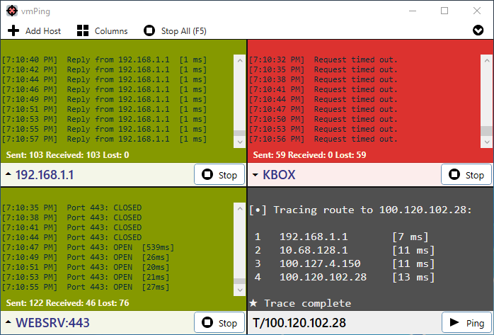
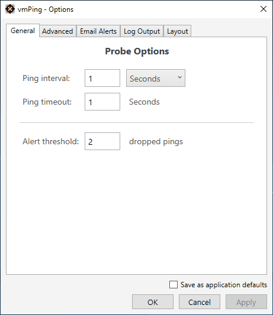
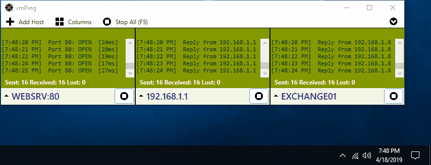

vmPing
======

vmPing (Visual Multi Ping) is a graphical ping utility for monitoring multiple hosts.  Numerous host monitors can be added and removed, and each monitor dynamically resizes with the application window.  Color-coding allows you to tell at a glance the status of each host.  In addition to standard ICMP pings, you can also perform a TCP 'port ping', where the application continuously connects to a specified port and displays whether or not the port is open.  A fast trace route utility and a basic packet generator / stress tester is also included.

**[Click here to download the latest release](https://github.com/R-Smith/vmPing/releases/latest/download/vmPing.exe)**
##### (1.3.8 released on February 23, 2021)

##### Notes
* There is no installer.  Just run the .exe.
* .NET 4.5 or greater is required.

Screenshots
-----------
##### Main Window

##### Options

##### Popup Notification

Recent Changes
--------------
### Version 1.3.8
* __New options window.__ The options window was given a minor makeover and now uses a vertical tab layout. This allows room for additional option screens in the future.
* New Notifications tab in the options window for configuring popup notifications. You can now save a default popup notification setting.
* New feature to auto-dismiss popup notifications. This is currently configured through the Notifications tab in the options window.
* New feature to play a sound when a host comes up (previously you could only play sounds when a host went down).
* If you have an alias set for a host, the alias is now shown in popup notifications and email alerts.
* Bug fix: TCP port pings to IPv6 targets now work. If pinging a port on an IPv6 address, wrap the address in brackets, such as *[::1]:443* where *::1* is the target IPv6 address and *443* is the target TCP port.

### Version 1.3.4
* Bug fix: A crash would occur if popup notifications were set to display only when minimized and a host status change occurred.  Thanks @chuckbales for the bug report!

### Version 1.3.3
* Improved handling of loading hosts from a text file to account for empty lines and comments.  Thanks @larntz for adding this feature!
* Added a __Test__ button to the __Email Alerts__ tab so that you can validate and test email alerting.  Thanks @bodagetta for the suggestion.
* Added a __Test__ button to the __Audio Alerts__ tab that plays the audio file you've selected.
* Added simple informational text to the __Email Alerts__ and __Audio Alerts__ tabs.
* Bug fix:  Logging status changes would fail if multiple hosts changed status at the same time.  This has been corrected.  Thanks @Sola1991 for the bug report.
* Bug fix:  When setting a default configuration that includes email alerts with authentication, the config write would fail.  This has been corrected.  Thanks @WNDNCG for the bug report.
* Bug fix:  Aliases would not show when loading hosts from the command line or after selecting a favorite set.  This has been corrected.  Thanks @MeatyFresh for the bug report.
* Bug fix:  Added error checking to audio alert playback.

### Version 1.3.2
* New option to trigger playing a sound when a host goes down.  The setting is found under the Audio Alerts tab on the options window.  Thanks @larntz for adding this feature!
* Bug fix:  Using the log file feature would not work on IPv6 hosts or hosts doing a TCP port ping due to invalid characters in the file name that was being generated.  This is now checked and logging will work in those situations.

### Version 1.3.1
* __New traceroute probe!__  In the hostname box, type __'T/name_or_ip'__ and it'll perform a traceroute right in a probe window.  This feature will become more apparent in a future release, and additional probe types are planned.  Eventually, the old separate traceroute window will go away.
* New option to log status changes to a text file.  This option only writes to the log when a host goes down or up.  The output is in a tab delimited format that is suitable for Excel or database imports.  Note: vmPing does not lock the file, so logging will fail if the file is opened by Excel and vmPing tries to write to the file.
* Fix for vmPing no longer reading hostnames from the command line.
* New command line option to specify a file containing a list of hostnames.  One host per line.  The file is read at startup and vmPing immediately begins pinging each host.  Remember to use quotes if your file path contains spaces.  Usage:  __'vmPing.exe <path_to_file>'__
* Darkened the default color for DNS and traceroute probes.  This is not yet customizable.
* The control bar that appears when you hover over a probe window is now darker (50% black with 50% transparency).  The icons are now darker and the highlight style was changed to accommodate the new colors.
* Re-styled the custom dialog window so it's wider and uses a smaller font.
* Extra tooltips explaining the options under Options -> Log Output.

Features
--------
* Quickly and easily ping multiple hosts.
* Color coding allows you to instantly determine the status of each host.  Green means up.  Red means down.  Orange means error.
* Each host monitor dynamically resizes and scales with the applications window.
* Options to configure the interval between each ping, the timeout, TTL, and message size.
* Monitor TCP ports.  vmPing will continuously connect to a given TCP port and will display whether the port is open or closed.  Enter _HOSTNAME:PORT_ for the hostname.  Example -  _WebserverA:80_
* Option to log everything to a text file.
* Option to log only status changes to a text file.  A status change is when a host you are pinging goes down, or a down host comes back up.
* Popup notifications to alert you of status changes.
* Email notifications on status changes.
* All colors can be customized.
* Favorites.  Easily save a collections of hosts to be recalled instantly at a later time.
* Aliases.  You can assign a friendly display name for any given host.
* Traceroute.  For the hostname, enter _T/HOSTNAME_ to perform a traceroute.
* DNS forward and reverse lookups.  For the hostname, enter _D/NAME_OR_IP_ to perform a DNS lookup.
* Specify any number of hosts from the command line to instantly begin pinging when the application opens.
* Specify a file containing a list of hosts to load and instantly ping when the application launches.
* Command line usage:
  * vmPing.exe [-i interval] [-w timeout] [`<target_host>`...] [`<file_to_load>`...]

Donations
---------
If this tool has been useful to you, consider donating using PayPal.

